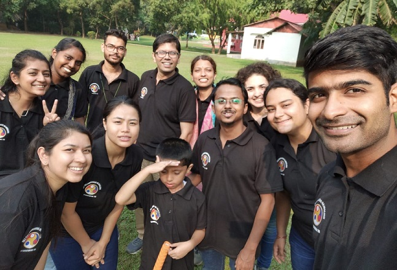

# Molecular Endocrinology Lab

Our research group seeks to understand estrogen signaling, and its effects on gene expression. The role and relevance of canonical and non-canonical estrogen receptors, and their gene targets in the development and progression of breast tumors, is of interest to us. We use routine cell and molecular biology approaches to answer specific questions related to mechanisms of estrogen-regulated gene expression. The long term goal is to identify useful biomarkers, or gene expression patterns that will assist in devising therapeutic strategies. We also study phytochemicals for their potential as estrogen receptor modulators.

## What's new from molendolab
Our latest paper on the estrogen regulation of the G-protein coupled estrogen receptor (GPER) in breast cancer cell lines is out. This work was a collaboration between Molecular Endocrinology Lab (IIT Guwahati), NIRRH (Mumbai), NEIGRIHMS (Shillon), and Dr. Bhubaneswar Borooah Cancer Institute (Guwahati). [link.](https://authors.elsevier.com/a/1hGqq_8cEQhuDb)

## Recent achievements
**Karanjin** has partial estrogen like effects. This was a transcriptomics study that recently go published in Gene. The paper highlights the enrichment of G2/M checkpoint and estrogen-response-early genes in karanjin modulated gene repertoire in MCF-7 breast cancer cells. Here is the [link](https://www.sciencedirect.com/science/article/pii/S0378111922003262) to the paper on the journal site.

### More about our work
1. [Research themes](./ResearchThemes.md)
2. [Publications](./publications.md)
3. [Team](./team.md)

